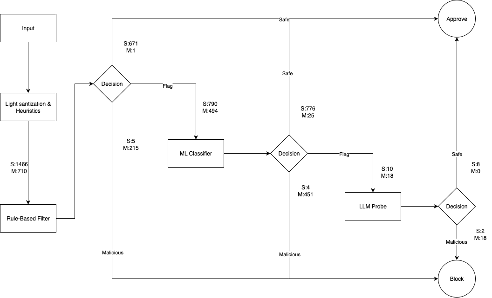

# Barrikada

**A Cost-Aware Tiered Defense Architecture for Prompt Injection in Agentic LLM Systems**

Barrikada is a modular security layer designed to protect agentic LLM systems from prompt injection attacks using a pragmatic, cost-aware, multi-tier architecture.

It combines lightweight pattern matching and machine learning filters with an optional LLM-as-a-Judge escalation layer to provide structured risk scoring, governance, and real-time policy enforcement, without making every request expensive.

---

## The Problem

As LLM systems evolve from chat interfaces into **tool-using agents**, the attack surface expands dramatically.

Modern agents:

* Read documents
* Call external APIs
* Execute code
* Access sensitive internal data

Prompt injection attacks can:

* Override system instructions
* Induce tool misuse
* Trigger data exfiltration
* Escalate privileges indirectly

Most current defenses rely on:

* Static prompt rules
* Regex filters
* Provider-level moderation

These approaches are insufficient for agentic systems.

Barrikada addresses this gap.

---

## Core Idea

Instead of treating prompt injection detection as a single binary classification task, Barrikada introduces a **tiered risk evaluation pipeline**:

### Layer A – Text Preprocessing & Normalization

* Unicode normalization and confusable character detection
* Encoding attack detection (Base64, hex, URL encoding)
* Invisible character and homoglyph detection
* Prepares clean text for downstream analysis

### Layer B – YARA Signature Matching

* Low latency (~0.08ms)
* Pattern-based detection of known injection signatures
* Allowlist matching for benign patterns
* Resolves ~43% of queries without ML inference

### Layer C – Lightweight ML Risk Model

* Logistic Regression classifier (~0.5ms)
* Context-aware classification for ambiguous cases
* Produces probabilistic risk score
* Handles queries that escape signature detection

### Layer D – LLM-as-a-Judge Escalation (Optional)

* Invoked only for uncertain or high-risk cases
* Performs structured, policy-grounded evaluation
* Outputs explainable risk assessment
* Recommends enforcement action

This design balances:

* **Cost** – Escalate only when necessary
* **Performance** – Sub-3ms latency for most requests
* **Security** – 96%+ detection accuracy
* **Auditability** – Structured outputs at every layer

---

## Architecture Overview



---

## Performance

Evaluated on a mixed corpus of 2,176 prompts (1,466 benign, 710 malicious):

| Metric | Value |
|--------|-------|
| **Overall Accuracy** | 96.28% |
| **Benign Accuracy** | 96.59% |
| **Malicious Accuracy** | 95.63% |
| **Avg Latency** | 2.69ms |
| **Layer B Resolution Rate** | 43.0% |
| **Layer B Accuracy** | 97.97% |
| **Layer C Accuracy** | 95.00% |

### Latency Breakdown

| Layer | Average Time |
|-------|--------------|
| Layer A (Preprocessing) | 2.32ms |
| Layer B (YARA Signatures) | 0.08ms |
| Layer C (ML Classifier) | 0.50ms |
| **Total Pipeline** | **2.69ms** |

### Pass-Through Rates

```
Layer A:  100% pass through (preprocessing only)
          ↓
Layer B:  43.0% resolved (935 queries)
          ↓ 57.0% pass through
Layer C:  57.0% resolved (1,241 queries)
```

---

## Why Tiered > Pure LLM Moderation

| Approach | Cost | Latency | Accuracy | Governance |
|----------|------|---------|----------|------------|
| Regex-only | Low | Low | Poor | Weak |
| LLM-only | High | ~2.5s | Good | Moderate |
| **Barrikada (Tiered)** | **Optimised** | **~2.7ms** | **96%+** | **Strong** |

---

## Threat Model

Barrikada focuses on defending against:

* Instruction override attacks (DAN, jailbreaks)
* System prompt extraction attempts
* Tool misuse induction
* Encoding-based obfuscation (Base64, hex, Unicode)
* Homoglyph and invisible character attacks
* Indirect injection via retrieved content
* Contextual manipulation in multi-step agents

It is designed for **agentic LLM systems**, not static chatbots.

---

## Use Cases

* AI copilots in enterprise SaaS
* Tool-using autonomous agents
* Internal AI assistants with sensitive data access
* Regulated environments requiring audit trails
* Agent frameworks (LangChain, AutoGen, custom stacks)
* API gateways requiring real-time prompt screening

---

## Project Structure

```
barrikada/
├── core/
│   ├── orchestrator.py      # Main pipeline coordinator
│   ├── settings.py          # Configuration
│   ├── layer_a/             # Text preprocessing
│   │   ├── pipeline.py
│   │   ├── unicode.py
│   │   ├── confusables.py
│   │   └── detect_encodings.py
│   ├── layer_b/             # YARA signature engine
│   │   ├── signature_engine.py
│   │   └── signatures/
│   ├── layer_c/             # ML classifier
│   │   ├── classifier.py
│   │   └── train.py
│   └── layer_e/             # LLM judge (optional)
│       └── llm_judge.py
├── models/                  # Data models
├── datasets/                # Training and test data
├── tests/                   # Unit tests
└── scripts/                 # Evaluation scripts
```

---

## Publication

This repository accompanies an academic paper:

> *Detecting and Mitigating Prompt Injection Attacks in Agentic AI systems*  
> (Publication pending)

---
